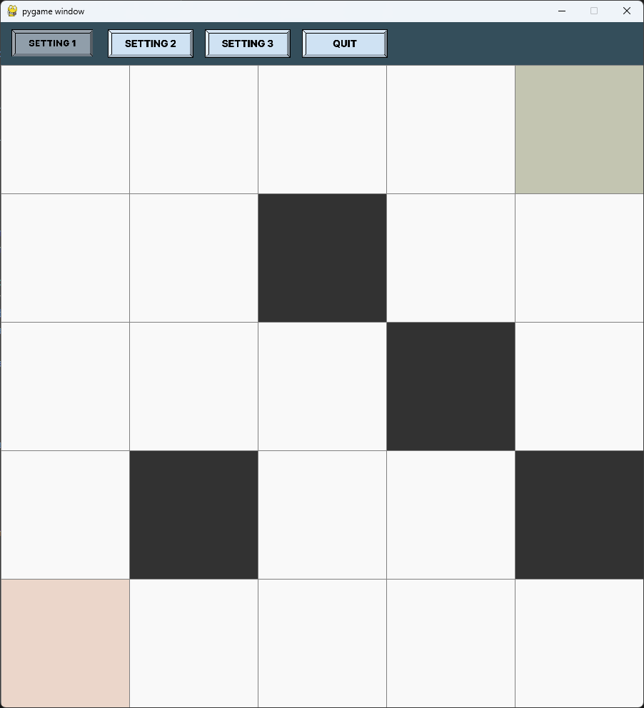
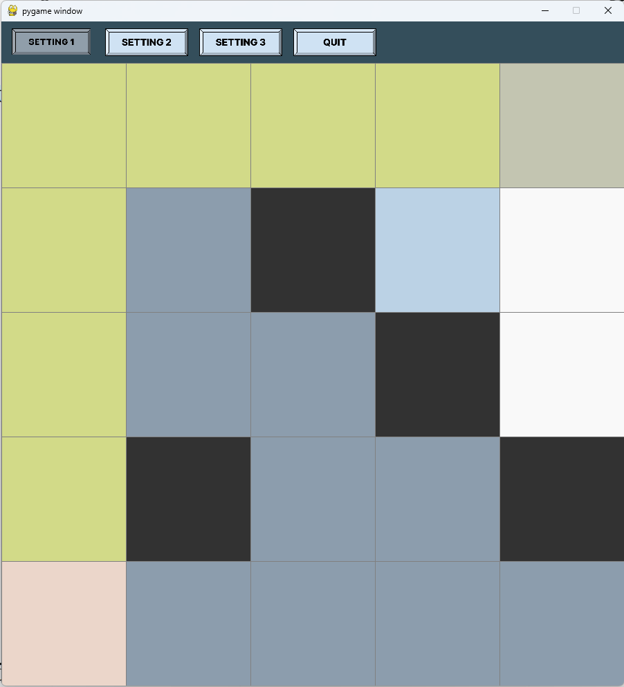
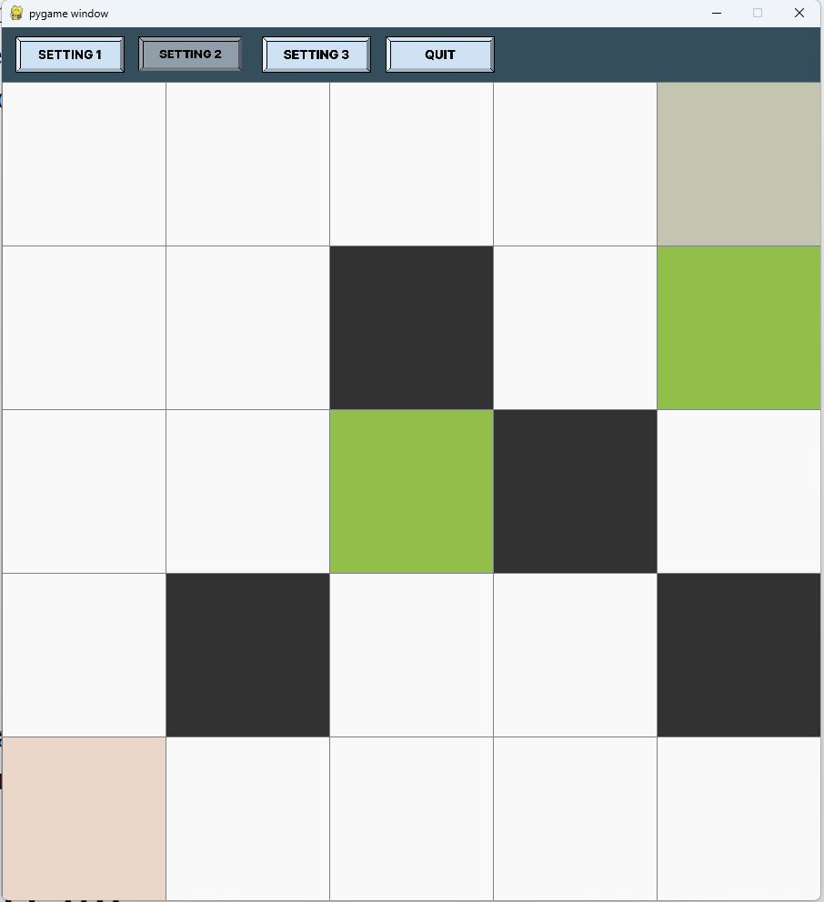
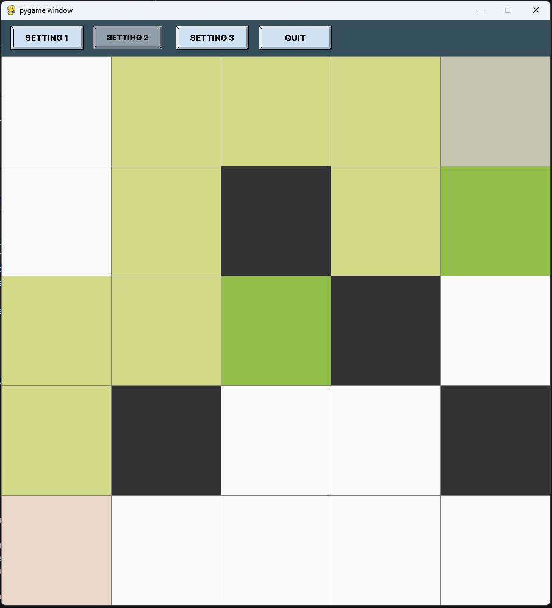
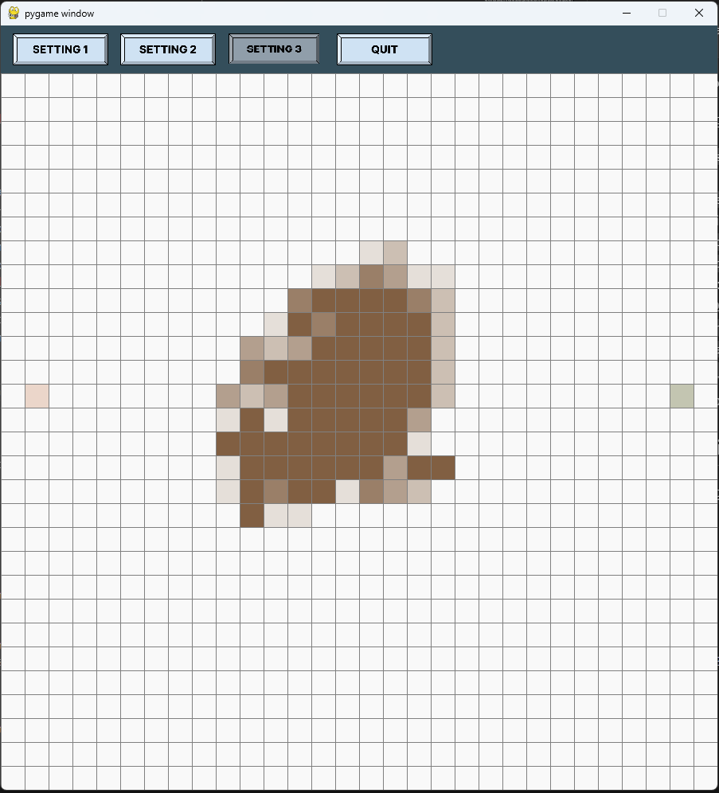
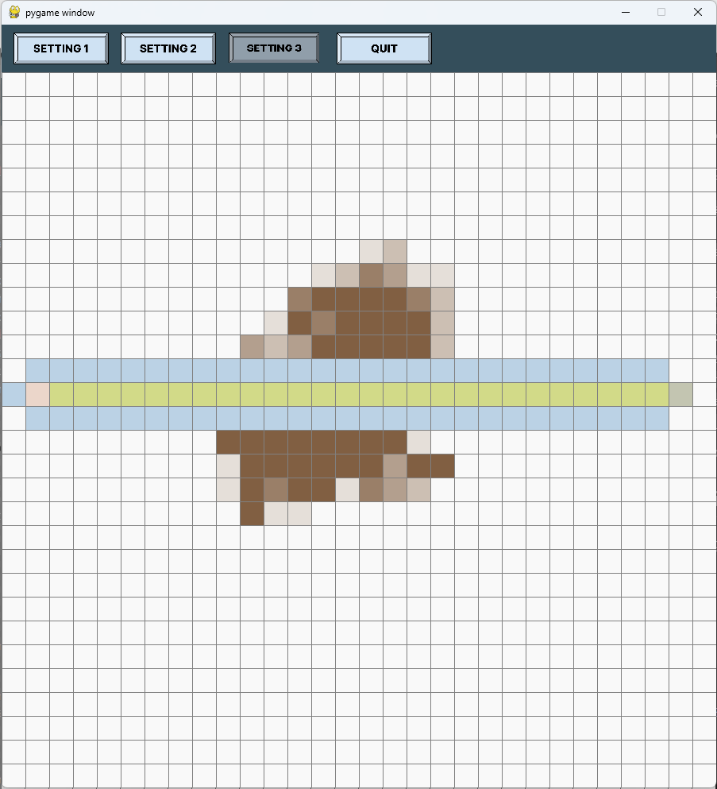
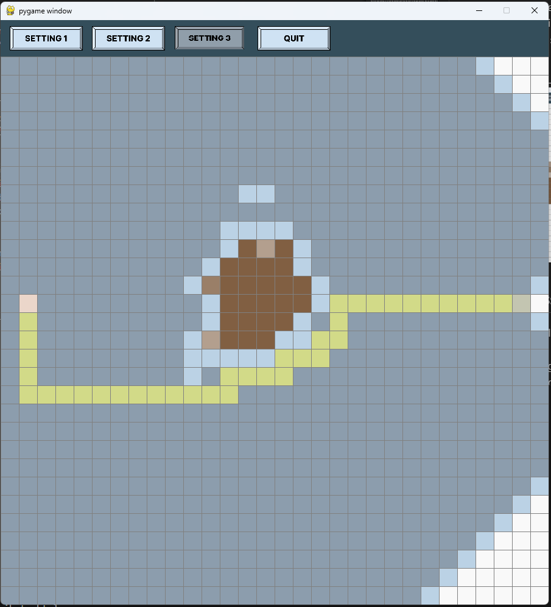

# Pathplanning

My implementation for the Path Planning problem for the HiWi Position @ AMLZ

## Installation

The libraries required to run the program are listed in ``requirements.txt``. 

[*Note*]: Ignore the ``requirements-dev.txt``, as it is only used 
for development purposes.

To install the required libraries, run the following command:

```bash 
pip install -r requirements.txt
```

## Usage

To run the program, use the following command:

```bash
python main.py
```

Use the ``-h`` or ``--help`` option to display available command-line options.

Mainly, through the command line, one can specify:
- ``--window_size``: Specifies the size of the window. Please note that the window size is fixed, and the grid will be resized to fit the window size. Please, you are encouraged to increase the window size as much as possible to have a better user experience. The default value is 700x700 pixels.
- ``--rows``: Specifies the number of rows and columns in the grid.
- ``--K`` Sets a value (between 0 and 1) for the A* algorithm heuristic.
- ``--deterministic_waypoints``: Determines whether to use the Held-Karp algorithm to find the optimal path in the Waypoint task.
- ``--epochs``, ``--number_ants``, ``--rho``, ``--Q``, ``--alpha``, - ``--beta``, ``--ini_pheromone``: Hyper-parameters for the ant colony optimization algorithm.

All arguments are optional, and default values will be used if not specified.

## Task Settings
Upon running the program, you can choose from three task settings by selecting the corresponding buttons in the top bar. In addition, there is a ``QUIT`` button to exit the program. 
The available tasks are:


### Task Setting 1 - Shortest Path Task

The first task setting is to find the shortest path from the start to the goal position. One can specify the start and goal positions interactively, using the mouse. More specifically, the user can left-click on the grid to set the start and goal positions. Once these are set, the user can left-click on other cells to set obstacles. To remove obstacles, the user can right-click on the obstacles. The start and goal positions can also be removed by right-clicking on them, but then, the following left-click will set the start position, and the next left-click will set the goal position. Once the start and goal positions are set, the user can press the ``Space`` key to run the [**A\* algorithm**](https://en.wikipedia.org/wiki/A*_search_algorithm) to find the shortest path. The user can also press the ``C`` key to clear the grid and start over. In this scenario, optimality (in terms of the shortest path) is guaranteed.

[*Note*]: The start node has a pink color, the goal node has a green color, and the obstacles have a black color. When running the A* algorithm, the nodes that are inserted into the open list (min heap) are colored in light blue, and the nodes that are removed and closed are colored in dark blue. The path found by the A* algorithm is colored in light green. Furthermore, if there is no path from the start to the goal position, the program will display a message to the user.

| Default Setting                  |   Solved |
|---------------------------|---------------------------|
|  |  

### Task Setting 2 - Waypoint Task
The second task setting is to find the shortest path from the start to the goal position while visiting a set of waypoints. When the user selects this task setting, the program will prompt the user to specify the number of waypoints. Once this is done, the user can specify the start and goal positions interactively, using the mouse, as in Task Setting 1. Once these are set, the user can left-click on other cells to set waypoints. To remove waypoints, the user can right-click on them. Once the start, goal, and waypoints are set, the user can press the ``Space`` key to run the specified algorithm to find the shortest path. The user can also press the ``C`` key to clear the grid and start over. Furthermore, if there is no path from the start to the goal position, such that all waypoints are visited, the program will display a message to the user.

It is worth noting that the user can also specify whether to use the [**Held-Karp**](https://en.wikipedia.org/wiki/Held%E2%80%93Karp_algorithm) algorithm to find the optimal path (in which case, optimality is guaranteed) or to use the [**Ant Colony Optimisation algorithm**](https://en.wikipedia.org/wiki/Ant_colony_optimization_algorithms) to find the path (in which case, the path is not guaranteed to be optimal). By default, the program uses the Ant Colony Optimisation algorithm with the following hyperparameter values:

- 100 epochs
- 10 ants
- 0.1 rho
- 1 Q
- 1 alpha
- 1 beta
- 1 initial pheromone

The user can change these hyperparameter values through the command line, as mentioned in the ``Usage`` section.

| Default Setting                  |   Solved |
|---------------------------|---------------------------|
|  |  

### Task Setting 3 - Coverage Task

The third task setting is to find the path from the start to the goal position, in a scenario with relief (i.e. the grid is not flat). The user can specify the start and goal positions interactively, using the mouse, as in Task Setting 1. Once these are set, the user can left-click on any cell to increase its height. To decrease the height of a cell, the user can right-click on it. Once the start and goal positions are set, the user can press the ``Space`` key to run the A* algorithm to find the shortest path. The user can also press the ``C`` key to clear the grid and start over. In this specific task setting, the A* algorithm is tweaked to account for the relief, and the path is found by considering the relief, therefore the path is not guaranteed to be the shortest path. Furthermore, the user can specify its preference in the "flatness"-"distance" trade-off, by using the ``K`` argument in the command line. The default value is 1, which means that the user prefers  aiming for a path that's as level as possible to avoid frequent climbs and descents. However, when ``K`` is set to 0, the user prefers aiming for the shortest path, regardless of the relief. 

In the next figure, this behavior is illustrated. The center image shows the path found by the A* algorithm with ``K`` set to 0, and the right image shows the path found by the A* algorithm with ``K`` set to 1, for the same start and goal positions and similar relief.

| Problem Setting                  | K = 0                  | K = 1                   |
|---------------------------|---------------------------|---------------------------|
|  |  |  |


## Known Issues

The following are known issues with the program. Most of them are related to the user interface, and I apologize for it, as I am not experienced in developing user interfaces, and less so in developing them in Python.
I mainly focused on the path-finding algorithms, and I acknowledge that the user interface could be improved.

- Generally, switching between task settings works fine. However, when switching to task setting 2 for the second time, the entry-text for the number of waypoints is displayed, yet the user cannot type anything. I appologise for this issue, and I am working on fixing it. For the moment, the user can halt the program and run it again to use task setting 2.

- Sometimes, if the click is hold for a long time, the program might register multiple clicks, which might lead to unexpected behaviour. This is especially noticeable in the third setting as the user might accidentally increase the height of a cell multiple times. 

- Although I have experimented with different values for the hyperparameters of the Ant Colony Optimisation algorithm, I have not yet found the optimal values. Therefore, the path found by the Ant Colony Optimisation algorithm might not be optimal. 

- While experimenting with task setting 2, I've encountered a scalability issue where the program stops functioning efficiently when the number of waypoints exceeds 30. This isn't due to a failure of the path-finding algorithms—neither the deterministic Held-Karp algorithm nor the Ant Colony Optimization algorithm—but rather the program becomes unresponsive due to inefficiencies in the path reconstruction function. I apologize for this inconvenience. Please understand that my primary focus has been on optimizing the path-finding algorithms themselves, as they are the core of this assignment. However, I acknowledge that I may have overlooked optimization efforts for the path reconstruction function, possibly using suboptimal data structures for storing computed paths.

## Report

In the report (``report.pdf``), I provide a detailed explanation of the algorithms used in the program, highlighting the differences between the algorithms used in the different task settings. 

